<p align="center">
  <a href="https://www.ajdinhalac.dev">
    
  </a>
</p>

<p align="center">
  <a href="https://www.ajdinhalac.dev"></a>
  <a href="https://www.linkedin.com/in/ajdin-halac/"></a>
  <a href="mailto:ajdin.halac@hotmail.com"></a>
  
</p>

<picture>
  <source media="(prefers-color-scheme: dark)" srcset="https://raw.githubusercontent.com/AjdinHalac/AjdinHalac/output/github-snake-dark.svg"/>
  <source media="(prefers-color-scheme: light)" srcset="https://raw.githubusercontent.com/AjdinHalac/AjdinHalac/output/github-snake.svg"/>
  
</picture>

### `> whoami`

```yaml
name:      Ajdin Halac
role:      Platform & Software Engineer
focus:     [Backend, Microservices, Domain-Driven Design, Software Architecture]
platform:  [Kubernetes, GitOps, CI/CD with GitHub Actions]
ask_me:    [Redis, Argo CD, Cloudflare]
stack:     [Go, Java, TypeScript, Node.js]
frontend:  [React, Next.js]
worked_in: [Startups, Scaleups, Enterprise]
building:  upti.my, open-source uptime monitoring written in Go
hobbies:   robots (Arduino, Raspberry Pi)
status:    Open to new problems worth solving
```

### `> ls ~/projects`

<p>
  <a href="https://upti.my"></a>
</p>

<p>
  <a href="https://github.com/uptimy/agent"></a>
  <a href="https://github.com/uptimy/uptimyctl"></a>
  <br/>
  <a href="https://github.com/AjdinHalac/Gommando"></a>
  <a href="https://github.com/AjdinHalac/yaml"></a>
</p>

### `> tech --list`

<p>
  
  
  
  
  
  
  
  
  
  
  
  
  
</p>

### `> stats --all-time`

<p>
  
  
</p>

<p align="center"><sub><code>// all your commits are belong to the snake</code></sub></p>
